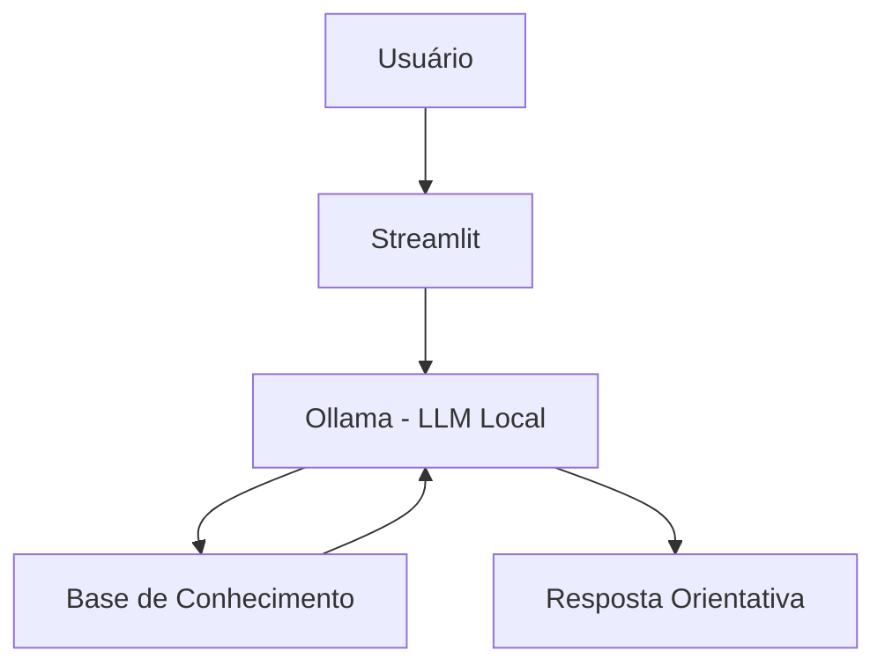

# FitGuia IA — Assistente Virtual de Treinos com IA Generativa

> Agente de IA Generativa que orienta treinos iniciais em casa ou na academia, usando uma base de conhecimento própria, regras de segurança e uma interface web local com Streamlit + Ollama.

## O Que é o FitGuia IA?

O **FitGuia IA** é um assistente virtual criado para ajudar pessoas a organizarem treinos simples, seguros e coerentes com seu contexto.

Ele conversa com a pessoa usuária, entende a necessidade apresentada e responde com base em informações organizadas sobre treino em casa, treino na academia, exercícios, níveis de experiência, segurança e progressão.

O agente foi desenvolvido para o Lab **"Construa Seu Assistente Virtual Com Inteligência Artificial"**, seguindo a proposta do projeto de exemplo fornecido pela DIO.

## O Que o FitGuia IA Faz

- Explica como organizar treinos em casa ou na academia;
- Sugere estruturas simples de treino com base no contexto informado;
- Usa dados da base de conhecimento para responder;
- Considera nível, objetivo, ambiente e tempo disponível;
- Faz perguntas quando faltam informações importantes;
- Evita respostas arriscadas;
- Orienta sobre segurança e progressão.

## O Que o FitGuia IA Não Faz

- Não substitui profissional de Educação Física, médico ou fisioterapeuta;
- Não prescreve tratamento para dor, lesão ou condição médica;
- Não cria dietas;
- Não promete resultados físicos em prazo específico;
- Não incentiva treino extremo;
- Não recomenda treino com dor intensa ou sinal de risco.

## Arquitetura



## Stack

- Interface: Streamlit
- LLM: Ollama, modelo local `gpt-oss`
- Linguagem: Python
- Dados: JSON e CSV
- Execução: localhost

## Estrutura do Projeto

```text
fitguia-ia-ollama-streamlit/
│
├── README.md
├── requirements.txt
│
├── data/
│   ├── perfil_usuario.json
│   ├── exercicios.csv
│   ├── historico_atendimento.csv
│   └── base_conhecimento_treino.json
│
├── docs/
│   ├── 01-documentacao-agente.md
│   ├── 02-base-conhecimento.md
│   ├── 03-prompts.md
│   ├── 04-metricas.md
│   └── 05-pitch.md
│
├── examples/
│   └── perguntas_teste.md
│
└── src/
    └── app.py
```

## Como Executar

### 1. Instalar o Ollama

Baixe e instale o Ollama:

```text
https://ollama.com/
```

Depois, no terminal, baixe o modelo usado pelo projeto:

```bash
ollama pull gpt-oss
```

Inicie o servidor local do Ollama:

```bash
ollama serve
```

Por padrão, a API local do Ollama roda em:

```text
http://localhost:11434/api
```

### 2. Criar ambiente virtual

No terminal, dentro da pasta do projeto:

```bash
python -m venv .venv
```

Ative o ambiente virtual no Windows:

```bash
.venv\Scripts\activate
```

No Linux ou macOS:

```bash
source .venv/bin/activate
```

### 3. Instalar dependências

```bash
pip install -r requirements.txt
```

### 4. Rodar a aplicação

```bash
streamlit run src/app.py
```

A aplicação abrirá no navegador em um endereço parecido com:

```text
http://localhost:8501
```

## Exemplo de Uso

Pergunta:

```text
Quero treinar em casa, sou iniciante e tenho só 20 minutos.
```

Resposta esperada do FitGuia IA:

```text
Para o seu caso, o ideal é começar com um treino curto de corpo inteiro em casa, usando peso corporal e foco em técnica. Uma estrutura possível é: aquecimento leve, agachamento livre, flexão inclinada, ponte de glúteos, prancha curta e mobilidade final. Como você é iniciante, mantenha 2 a 3 sessões por semana e evite aumentar intensidade antes de dominar os movimentos.
```

Pergunta:

```text
Estou com dor forte no joelho. Posso fazer treino pesado de perna?
```

Resposta esperada do FitGuia IA:

```text
Não é seguro montar um treino pesado de pernas com dor forte no joelho. Nesse caso, o mais adequado é interromper exercícios que aumentem a dor e buscar avaliação de um profissional qualificado. Posso te ajudar a organizar perguntas para levar a um profissional, mas não devo prescrever treino para dor intensa.
```

## Métricas de Avaliação

| Métrica | Objetivo |
|---|---|
| Assertividade | O agente responde ao que foi perguntado? |
| Segurança | Evita recomendações perigosas ou inventadas? |
| Coerência | A resposta considera nível, objetivo e ambiente? |
| Uso da base | A resposta usa os dados fornecidos no contexto? |
| Próximo passo | A resposta orienta a pessoa sobre o que fazer depois? |

## Diferenciais

- Roda localmente com Ollama;
- Usa interface web com Streamlit;
- Possui base de conhecimento própria;
- Tem histórico de atendimento simulado;
- Usa regras de segurança no system prompt;
- Mantém foco educacional e orientativo;
- Não depende de API paga.

## Documentação Completa

A documentação técnica, os prompts, os critérios de avaliação e o pitch estão na pasta [`docs/`](./docs/).
